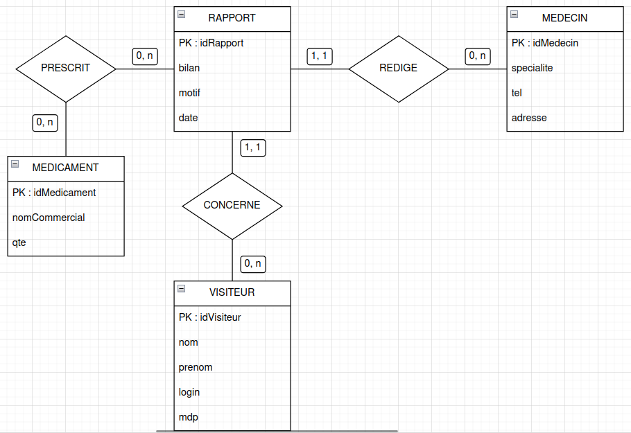
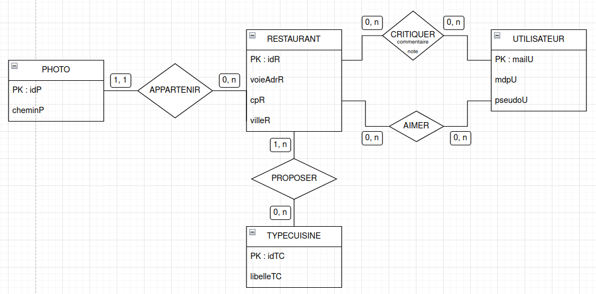

# TP1 - Maintenance applicative

LAVENANT Jordan - BUT 3 Informatique - Groupe 1

## Exercice 1

### 1.1

RAPPORT(<u>idRapport</u>, #idMedecin, #idVisiteur, bilan, motif, date, lesMedicaments
)

MEDICAMENT(<u>idMedicament</u>, #idRapport, nomCommercial, qte)

MEDECIN(<u>idMedecin</u>, specialite, tel, adresse)

VISITEUR(<u>idVisiteur</u>, nom, prenom, login, mdp)

### 1.2

MCD associé :

## Exercice 2

### 1.1

AIMER(#idR, #mailU)

CRITIQUE(<u>idC</u>, #idR, #mailU, note, commentaire)

PHOTO(<u>idP</u>, #idR, cheminP)

RESTAURANT(<u>idR</u>, voieAdrR, cpR, villeR)

TYPECUISINE(<u>idTC</u>, libelleTC)

UTILISATEUR(<u>mailU</u>, mdpU, pseudoU)

### 1.2

MCD associé :

## Exercice 3